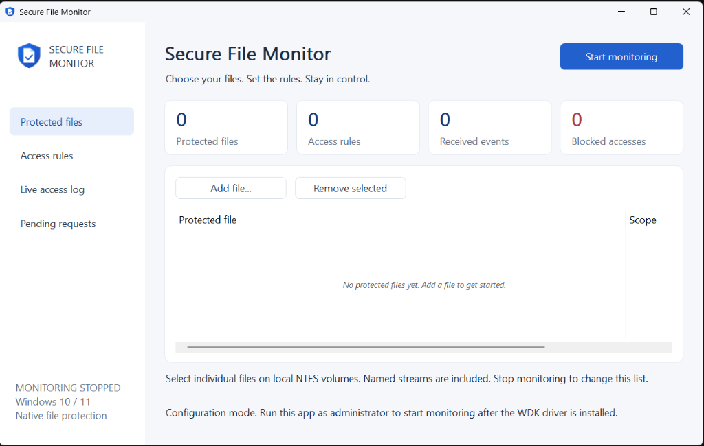

# Secure File Monitor

A native C++ Windows desktop application and file-system security monitor for tracking and controlling access to selected local files. The Visual Studio 2026 solution contains the Win32 GUI, tray integration, dual kernel interception modes (custom minifilter + officially signed ProcMon fallback), rule engine, persistent logging, and an I/O test probe.



### Dual-Driver Architecture

Secure File Monitor supports two operational driver modes:

1. **Active Interception Mode (`SecureFileMonitor.sys`)**:
   - Uses the custom WDK minifilter driver for pre-operation I/O interception (`IRP_MJ_CREATE`, `IRP_MJ_READ`, `IRP_MJ_WRITE`).
   - Supports active blocking, fail-closed timeouts, and interactive user decision prompts (Allow / Deny / Remember rule).
   - Intended for testing environments with test-signing enabled (Windows Test Mode / VM).

2. **Passive Notification Fallback (`PROCMON24.SYS` or `PROCMON25.SYS`)**:
   - When the custom driver is not loaded (e.g., standard retail Windows installations where Test Mode cannot be enabled), the application automatically falls back to the officially signed [Microsoft Sysinternals Process Monitor](https://learn.microsoft.com/en-us/sysinternals/downloads/procmon) driver (`PROCMON24.SYS` or `PROCMON25.SYS`).
   - Leverages `procmonsdk` to attach to the official ProcMon kernel driver without triggering driver signature enforcement warnings.
   - Operates in non-blocking observation mode: whenever any protected file is accessed by an external process, the app logs the access and immediately alerts the user via a Windows tray balloon notification, skipping modal decision prompts.

## Features

- Native Windows 10/11-style interface: sidebar navigation, status cards, rounded controls, DPI awareness, keyboard navigation, and native file/rule dialogs.
- Original multi-resolution app/tray icon, with editable SVG source.
- Dual-mode driver support: active pre-operation blocking via custom minifilter or zero-friction passive notifications via signed Sysinternals driver without Test Mode.
- Select up to 128 individual files on local NTFS volumes, with individual enable/disable checkboxes and automatic detection of common sensitive files.
- Intercept supported user-mode `IRP_MJ_CREATE`, `IRP_MJ_READ`, and `IRP_MJ_WRITE` operations before they proceed (active mode).
- Tray notification and a decision dialog with a countdown, executable path, PID, target file, and requested access (active mode).
- Instant balloon notification and logging on protected file access without interrupting workflow (ProcMon fallback mode).
- Allow or deny the current operation, grant permission for that process lifetime, or save an executable/file rule.
- Separate read/write permissions and Ask/Allow/Deny rules. Rules match full executable paths, not just process names.
- Actual I/O completion status and transferred bytes in the log, separate from the policy decision.
- JSONL and spreadsheet-safe CSV logs for every event received during the application session. Export the entire current CSV, not just visible rows.
- Dedicated **Options** tab: toggle Windows startup integration (launches with admin privileges at user logon) and configure automatic monitoring start on launch.
- Persistent driver status line displaying exactly which driver is loaded (`SecureFileMonitor.sys` in Active mode, `Sysinternals ProcMon` in Notification mode, or `No driver is loaded`).
- Fail-closed decisions on timeout, disconnect, overload, and unsafe-to-defer matching requests. Explicitly stopping monitoring disables interception.

## Open and build in Visual Studio

1. Open **`SecureFileMonitor.sln`** in **Visual Studio 2026**.
2. Install **Desktop development with C++**, the **MSVC v145** tools, the **Windows Driver Kit** Visual Studio component, and the actual **Windows SDK + WDK 10.0.28000.0**. The driver project pins that kit version; retarget it if using another compatible WDK. The Visual Studio component alone does not contain the kernel headers/libraries.
3. Select **Debug | x64** or **Release | x64** and choose **Build Solution**.
4. Set **SecureFileMonitor.App** as the startup project. The application manifest requires administrator privileges (`requireAdministrator`), automatically prompting for UAC elevation on launch so the kernel drivers can be loaded and controlled immediately.

All four projects compile with warning level 4 and warnings treated as errors. The app and tools use the static C++ runtime; there are no NuGet, .NET, Qt, or web runtime dependencies.

From PowerShell:

```powershell
.\scripts\Build.ps1 -Configuration Release

# Build the GUI, tests, and I/O probe without requiring the WDK:
.\scripts\Build.ps1 -Configuration Release -AppOnly
```

The build script selects the installed Visual Studio and 64-bit MSBuild, normalizes inherited build environment variables, and uses the SDK/WDK toolsets directly. Build does not sign, install, or load any driver and does not change Windows security settings.

| Project | Output path | Purpose |
|---|---|---|
| procmonsdk | `sdk\procmonsdk\x64\Release\procmonsdk.lib` | OpenProcMon SDK library for Sysinternals driver communication |
| SecureFileMonitor.App | `out\x64\Release\SecureFileMonitor.App\SecureFileMonitor.App.exe` | Desktop GUI, rules, tray, decision broker, ProcMon monitor, logs |
| SecureFileMonitor.Driver | `out\x64\Release\SecureFileMonitor.Driver\SecureFileMonitor.sys` | File-system minifilter for active pre-op interception |
| SecureFileMonitor.Tests | `out\x64\Release\SecureFileMonitor.Tests\SecureFileMonitor.Tests.exe` | Native rule/protocol/storage tests |
| IoProbe | `out\x64\Release\IoProbe\IoProbe.exe` | Real read/append operations from a separate process |

## First monitoring session

Follow [driver-validation.md](docs/driver-validation.md) to sign, install, and load the driver in your test VM.

1. Run the app as administrator.
2. In **Protected files**, add an existing disposable file on a local NTFS disk.
3. In **Access rules**, optionally add rules for your test executable. With no rule, each matching request prompts.
4. Click **Start monitoring**. If the driver cannot be contacted, the app reports the error and remains stopped.
5. Open/read/append the selected file with another program. Review the prompt or click the tray notification.
6. Inspect **Live access log**. An allowed request can still fail at the file system; the NTSTATUS column records that actual result.
7. **Stop monitoring** disables new interception and continues draining received completion events. Closing the main window keeps the app in the tray. **Exit** in the tray menu stops monitoring and exits.

A single application action can generate multiple operations. For example, opening and reading a file normally produces both an Open request and a Read request. Uncheck both remember options to approve only the current operation. The process-lifetime option avoids repeated prompts for the same file and approved access types; it verifies process creation time so a recycled PID cannot inherit permission.

Read-only approval does not approve a read/write open. Denying an open that requested write access may prevent an editor from opening the file even if it initially only wants to display its contents. This is deliberate: the driver evaluates the access actually requested by Windows.

## Rules and storage

Rules are applied to exact selected paths and full executable paths, compared case-insensitively. An empty application field explicitly matches every program, including a process whose executable path could not be resolved.

1. Any matching **Deny** for a requested access bit denies the whole operation.
2. Otherwise, a matching **Ask** requires a decision.
3. Otherwise, **Allow** must cover every requested read/write bit. Multiple allow rules can combine.
4. Unmatched access asks the user.

Saved rules outrank temporary process permissions. Editing rules clears temporary permissions. Saving an Allow from a prompt does not override a broader Ask/Deny rule; edit that rule if you want different precedence. The default timeout is 20 seconds and the fallback decision is Deny. The window's Close/Escape action denies only the current operation.

Files are stored under **`%LOCALAPPDATA%\SecureFileMonitor`** for the account running the app:

- `settings.sfm`: versioned UTF-8 settings, atomically replaced after validation.
- `Logs\session-<UTC timestamp>-<PID>.jsonl`: structured access records and diagnostics.
- `Logs\session-<UTC timestamp>-<PID>.csv`: the same access records in spreadsheet form, with diagnostic rows for audit gaps.

Logs include the original request timestamp, completion timestamp, request ID, PID, process creation time, executable path, display/NT file path, operation, decision, reason, phase, NTSTATUS, requested/transferred bytes, offset, and desired-access mask. Unknown/exited processes remain explicitly unknown. File contents are not collected. The GUI retains at most 2,000 rows; disk logs are not automatically rotated or deleted. Buffer loss is counted and written as `lost_events`; unresolved file names are reported as `name_lookup_failures`.

## Coverage and limits

This implementation is **path-based attended access control**, not a complete endpoint-security boundary. These limits matter when interpreting “all access”:

- It covers the registered create/read/write IRPs for selected paths on **local NTFS**. Network shares, non-NTFS volumes, raw-volume I/O, and directory policies are outside the current scope.
- Memory-mapped loads/stores do not each issue file-system read/write requests. Paging I/O, kernel-originated operations, and the broker's own I/O are excluded to avoid memory-manager and broker deadlocks. Already established mappings are not revoked.
- Unresolvable names cannot be matched and are bypassed with a diagnostic counter. Matching operations that cannot safely be deferred are denied. A successful file open does not guarantee a later read/write can be deferred.
- Hard-link aliases, file-ID opens, case-sensitive directories, reparse/name-provider behavior, renames/replacements, and metadata operations need further identity-based enforcement work. The policy follows the configured normalized path, not every identity/alias of the underlying file. Do not use this version as an adversarial security boundary.
- A maximum of 16 pending decisions bounds worker consumption; excess matching requests are denied. The finite 2,048-record kernel ring can overflow under load. Long-running I/O can complete after shutdown has stopped collecting events. Logs explicitly report known gaps; they are not tamper-proof or a lossless forensic audit.
- Graceful Stop/Exit disables interception. An unexpected broker failure retains enabled paths in the loaded driver and denies intercepted operations. Reconnect the app or run `fltmc unload SecureFileMonitor` as administrator to recover. Reboot starts the demand-start driver disabled until the app configures it again.
- A local administrator can unload the driver, replace executables, or change configuration. Rules verify executable paths, not cryptographic publisher identity.
- GUI layout, notifications, cancellation, mapped I/O behavior, concurrency, driver unload, and crash recovery still require your manual VM testing. See the validation guide.

The notification is a real Windows notification-area balloon. Windows notification settings/Focus Assist may suppress its visual display; the separate decision dialog and deadline continue to work.

## Tests and source layout

```powershell
.\scripts\Test.ps1 -Configuration Release
```

The native test suite checks rule precedence, combined-access authorization, path boundaries and streams, executable identity, Unicode/JSON/CSV escaping, configuration validation/atomic persistence, wire layout, PID creation-time checking, and log/export content. It does not load the kernel driver.

- `app/`: Win32 GUI, core rules, broker, ProcMon monitor wrapper, storage and logging.
- `sdk/procmonsdk/`: OpenProcMon SDK library for communication with official Sysinternals `PROCMON24.SYS` / `PROCMON25.SYS`.
- `driver/`: minifilter C++, WDK project, and INF.
- `shared/Protocol.h`: fixed-layout versioned communication contract with compile-time size checks.
- `tests/`: native test runner.
- `tools/`: read/write probe.
- `assets/`: original app icon (`monitor.svg`, `monitor.ico`) and application screenshot (`screenshot.png`). Regenerate the ICO with `scripts\Generate-Icon.ps1`.
- `scripts/`: build, test, development signing/install/removal helpers.
- `docs/`: architecture and manual driver validation.

## Microsoft API references

The implementation follows [minifilter communication ports](https://learn.microsoft.com/en-us/windows-hardware/drivers/ifs/communication-between-user-mode-and-kernel-mode), [deferring an I/O operation](https://learn.microsoft.com/en-us/windows-hardware/drivers/ddi/fltkernel/nf-fltkernel-fltqueuedeferredioworkitem), [FltSendMessage timeout semantics](https://learn.microsoft.com/en-us/windows-hardware/drivers/ddi/fltkernel/nf-fltkernel-fltsendmessage), and [minifilter INF requirements](https://learn.microsoft.com/en-us/windows-hardware/drivers/ifs/creating-an-inf-file-for-a-minifilter-driver).

## License

This project is licensed under the MIT License - see the [LICENSE](LICENSE) file for details.

