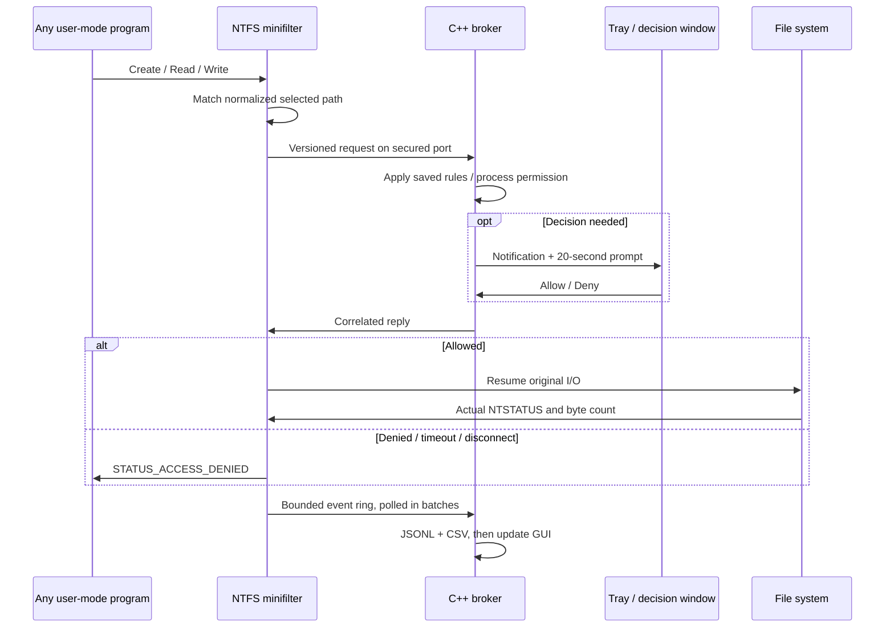

# Implementation and operation flow

## Kernel

The filter attaches automatically only to local disk NTFS volumes. Its port uses Filter Manager's default SYSTEM/administrator security descriptor and accepts one broker. Configuration messages are copied from user memory inside structured exception handling, checked for protocol version, exact message size, file count, path prefix and string termination, and swapped under a push lock. No user pointer is retained.

Preoperation callbacks exclude the broker process, kernel-originated I/O and paging I/O. Fast I/O is forced to retry as an IRP while monitoring is enabled. Normalized-name matching uses an exact file boundary or the named-stream separator. Matching requests have a nonpaged context allocated, including original requestor PID and process creation time.

The original request is pended using `FltQueueDeferredIoWorkItem`. A bounded set of work items communicates with the broker using `FltSendMessage`; an absolute UTC deadline prevents the delivery and reply waits from each receiving a fresh 20-second budget. `STATUS_TIMEOUT` is handled explicitly, because it satisfies `NT_SUCCESS` but must never authorize an access. A valid Allow resumes the original operation with a postoperation callback. All fallback cases deny the intercepted request.

Postoperation logging uses the actual `IoStatus.Status` and `IoStatus.Information`; it does not communicate with user mode from an arbitrary completion IRQL. The nonpaged ring uses a spin lock. A polling message drains at most 24 events. If allocation/ring/draining problems cause known event loss, a monotonically counted gap is exposed to the broker.

Driver code uses no C++ runtime, exceptions, static constructors, STL, or user-mode memory. The filter is demand-start, is initially disabled, and retains enabled path configuration if the connected broker crashes. Explicit Stop configures `Enabled = 0` before completing pending prompts as denied.

Deferred system work items and interactive decisions must be stress-tested together. This is a development choice, with a maximum of 16 outstanding requests. A production revision should use an explicitly managed cancel-safe queue, a dedicated worker design, file-identity tracking, publisher verification, and broader metadata/mapping coverage.

## Broker and GUI

One receiver thread uses overlapped `FilterGetMessage`; it keeps receiving while the GUI handles multiple pending prompts. Automatic rules reply immediately. The receiver does not wait on a modal UI dialog. Process names are resolved with limited-query process handles and verified against kernel-supplied creation time; cached names are keyed by both PID and creation time.

A separate thread drains driver events and expires pending prompts before the kernel deadline. Logging happens before GUI delivery. UI delivery is bounded independently, so clearing or truncating the visible list does not delete disk logs. Log files are flushed every second and on graceful stop/export; sudden system failure can still lose buffered writes.

The main window uses Win32 controls, GDI+ drawing, DWM corner/caption preferences, a PerMonitorV2 manifest, and Segoe UI. Windows 10 ignores unsupported Windows 11 DWM attributes and retains normal window behavior. Tray registration is restored after Explorer's `TaskbarCreated` notification. Closing the main window hides it; tray Exit disarms and shuts down.

`settings.sfm` stores only user-visible file paths and rules. Each Start resolves current normalized NT device paths, so saved drive letters are not blindly reused as stale kernel volume names after reboot. Any resolution failure prevents partial activation. Corrupt configuration is left untouched and prevents saving/monitoring until repaired.

## Protocol

The shared header uses fixed-width Windows integer types and fixed UTF-16 arrays, packed/aligned to 8 bytes. Assertions verify request/event/reply sizes and path offsets in both builds. Broker-side assertions also verify Filter Manager message header offsets. Wire messages contain no pointers or variable-size strings. The Filter Manager reply length is the header size plus reply payload size, without inferred trailing structure padding.

The log records authorized attempts and completed I/O as different phases. `Allow` is a policy decision; success or failure is determined by NTSTATUS. Create/open records have zero transferred bytes because the create completion information field is a disposition, not a byte count.

